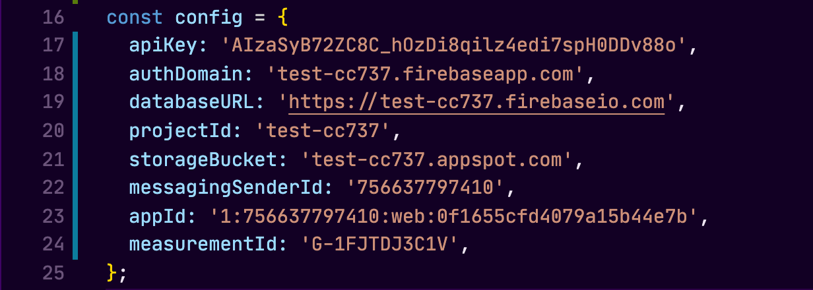

&nbsp;&nbsp;&nbsp;&nbsp;&nbsp;&nbsp;In my last post we talked about why you would want to use firebase to handle your app's authentication, and in this post we will dig into how. This is meant to give you quick overview on how to get started, not a full guide. We will be talking in the context of a Node.js / React project environment.

## The Firebase Console

&nbsp;&nbsp;&nbsp;&nbsp;&nbsp;&nbsp;First we will need to visit the Firebase console. If you do not already have a google account, you will need to create one and sign in. Once you have an account and have logged in, you should be able to navigate to the admin console at https://console.firebase.google.com

&nbsp;&nbsp;&nbsp;&nbsp;&nbsp;&nbsp;Once you are in the conosle, we will want to create a project and run through the project creation wizard:

&nbsp;&nbsp;&nbsp;&nbsp;&nbsp;&nbsp;Now that we have our Firebase project created, let's navigate to the authentication area, and look at the sign-in methods:

&nbsp;&nbsp;&nbsp;&nbsp;&nbsp;&nbsp;As you can see, we have multiple sign-in providers to choose from! This is probably my favorite feature of Firebase thus far. The ability to EASILY integrate sign-in's with accounts a user already has. This greatly reduces the barrier of entry to our applications. We want to make it as easy as possible for users to able to use our application, and this is a great way to eliminate a tedious and lengthy registration form.

&nbsp;&nbsp;&nbsp;&nbsp;&nbsp;&nbsp;Let's enable the Google sign in provider, then navigate to our project's home dashboard and register our web app with firebase:

&nbsp;&nbsp;&nbsp;&nbsp;&nbsp;&nbsp;After registration, you'll be provided with a code snippet that we will need to use to configure our web application. All we need from this snippet is the object assigned to the variable 'firebaseConfig':

## Installing The SDK

&nbsp;&nbsp;&nbsp;&nbsp;&nbsp;&nbsp;Now that we have Firebase configured on the console side, we are ready to install the SDK. Installing the SDK gives us new methods to use in our application that allow us make specific calls to our new Firebase project. Open up our terminal and navigate to the projects root directory, and run the command:

`npm i firebase`

We are assuming you have Node.js installed in your dev environment.

## The Code

&nbsp;&nbsp;&nbsp;&nbsp;&nbsp;&nbsp;In our React project, let's navigate to the src folder and create a new folder for firebase. In that folder, we will create a new JavaScript file called firebase.utils.js to house our firebase config settings.

&nbsp;&nbsp;&nbsp;&nbsp;&nbsp;&nbsp;Now let's dive into connecting our app to Firebase. Import the following from the Firebase SDK into our newly created utility file:

`import firebase from 'firebase/app';`

`import 'firebase/auth';`

&nbsp;&nbsp;&nbsp;&nbsp;&nbsp;&nbsp;The above imports allow us to use specific methods provided by Firebase for configuring our application. Remember the config object we set aside for later? Now here is where it comes into play. We will create a new object called config with this data in it. It should look like the following:

&nbsp;&nbsp;&nbsp;&nbsp;&nbsp;&nbsp;Now let's initialize our app by passing in the config object and calling the following method:

`firebase.initializeApp(config);`

&nbsp;&nbsp;&nbsp;&nbsp;&nbsp;&nbsp;Next let's export the following method as the variable auth so we call this method as we need it through out our application:

`export const auth = firebase.auth();`

&nbsp;&nbsp;&nbsp;&nbsp;&nbsp;&nbsp;Finally, we can now configure a couple of options specific to the google sign-in provider we have enabled. We will want to create a variable called provider and set it with the following:

`const provider = new firebase.auth.GoogleAuthProvider();`

&nbsp;&nbsp;&nbsp;&nbsp;&nbsp;&nbsp;With this new variable, we can now chain on some cutom parameters to the provider with the .setCustomParameters() method. We will enforce the google sign-in pop up for account selection everytime we call the user to sign-in with google:

`provider.setCustomParameters({ prompt: 'select_account' });`

## Quick Wrap up

## What's next?
