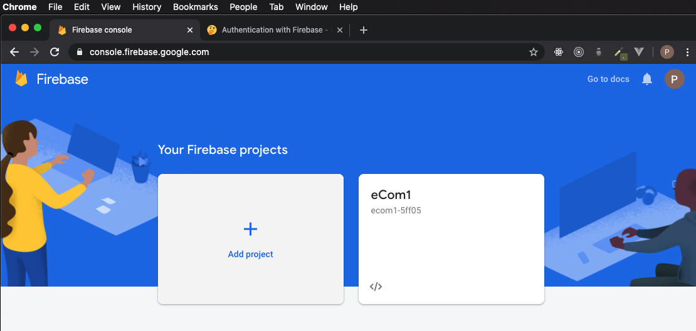
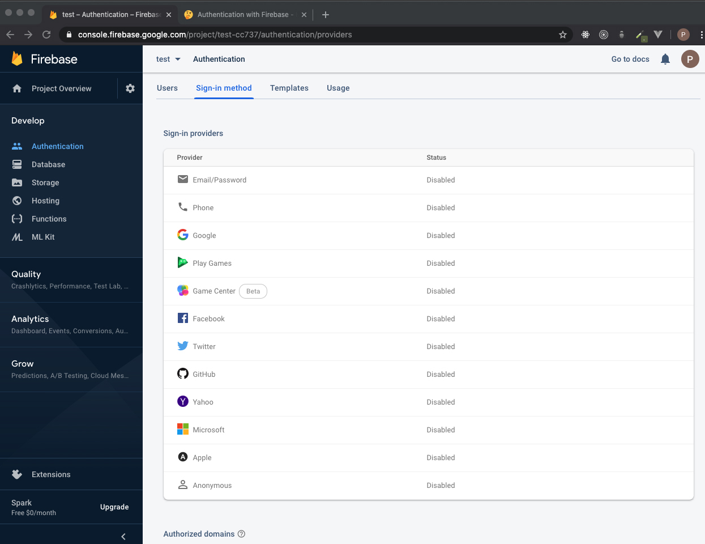
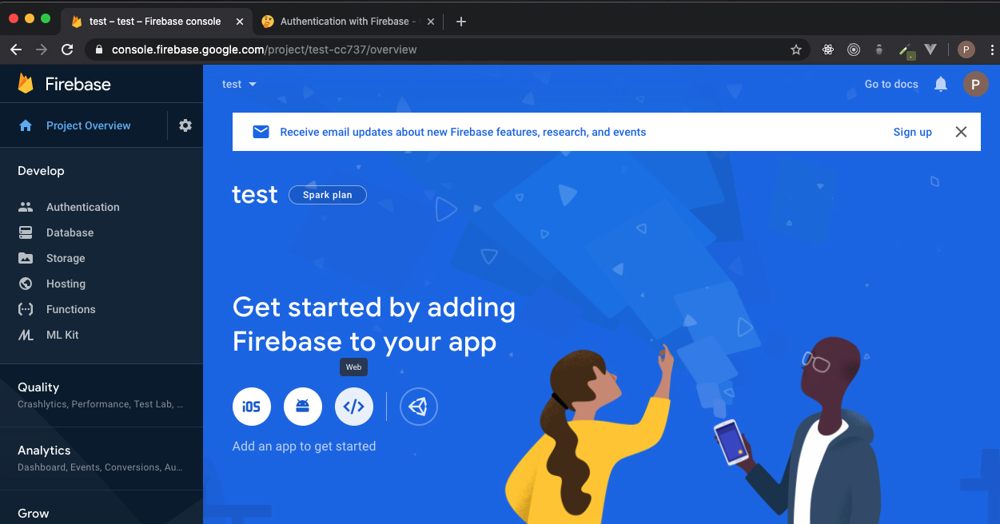
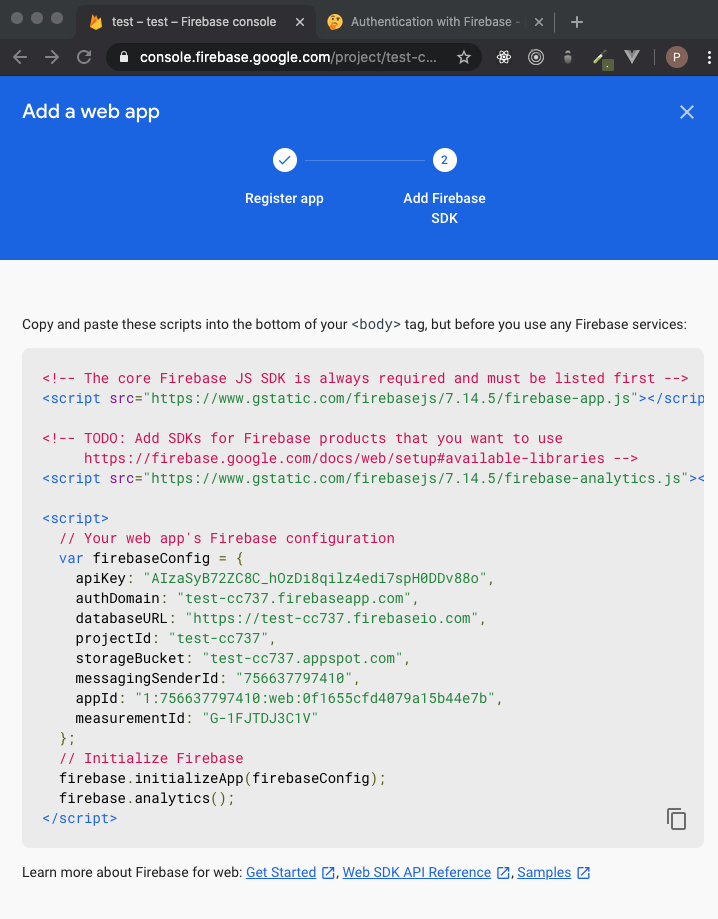
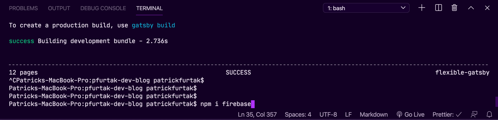

&nbsp;&nbsp;&nbsp;&nbsp;&nbsp;&nbsp;In my last post we talked about why you would want to use firebase to handle your app's authentication, and in this post we will dig into how. This is meant to give you quick overview on how to get started, not a full guide. We will be talking in the context of a Node.js / React project environment.

## The Firebase Console

&nbsp;&nbsp;&nbsp;&nbsp;&nbsp;&nbsp;First we will need to visit the Firebase console. If you do not already have a google account, you will need to create one and sign in. Once you have an account and have logged in, you should be able to navigate to the admin console at https://console.firebase.google.com

&nbsp;&nbsp;&nbsp;&nbsp;&nbsp;&nbsp;Once you are in the conosle, we will want to create a project and run through the project creation wizard:

&nbsp;&nbsp;&nbsp;&nbsp;&nbsp;&nbsp;Now that we have our Firebase project created, let's navigate to the authentication area, and look at the sign-in methods:

&nbsp;&nbsp;&nbsp;&nbsp;&nbsp;&nbsp;As you can see, we have multiple sign-in providers to choose from! This is probably my favorite feature of Firebase thus far. The ability to EASILY integrate sign-in's with accounts a user already has. This greatly reduces the barrier of entry to our applications. We want to make it as easy as possible for users to able to use our application, and this is a great way to eliminate a tedious and lengthy registration form.

&nbsp;&nbsp;&nbsp;&nbsp;&nbsp;&nbsp;Let's enable the Google sign in provider, then navigate to our project's home dashboard and register our web app with firebase:

&nbsp;&nbsp;&nbsp;&nbsp;&nbsp;&nbsp;After registration, you'll be provided with a code snippet that we will need to use to configure our web application. All we need from this snippet is the object assigned to the variable 'firebaseConfig':

## Installing The SDK

&nbsp;&nbsp;&nbsp;&nbsp;&nbsp;&nbsp;Now that we have Firebase configured on the console side, we are ready to install the SDK. Installing the SDK gives us new methods to use in our application that allow us make specific calls to our new Firebase project. Open up our terminal and navigate to the projects root directory, and run the command npm i firebase

We are assuming you have Node.js installed in your dev environment.

## The Code

## Quick Wrap up

&nbsp;&nbsp;&nbsp;&nbsp;&nbsp;&nbsp;In my opinion the biggest advantage to using Firebase for auth is being able to offload complexity and responsibility. The bigger your organization and the better your talent is, this does become less of a factor. Security professionals earn six-figure salaries for a reason, the work is technically complex, and the stakes are extremely high. I've personally seen how ruthless people can be when a security compromise occurs. "Blame-storming" is an all too accurate term, and you do not want any part of that; trust me.

&nbsp;&nbsp;&nbsp;&nbsp;&nbsp;&nbsp;For small teams and personal projects, I see Firebase as a huge asset. For large enterprise applications who have the personnel to handle authentication themselves, Firebase doesn't make as much sense to use. Depending on the scale of the application, it would be much cheaper to have a security professional or team to make sure everything is secure.

## What's next?

&nbsp;&nbsp;&nbsp;&nbsp;&nbsp;&nbsp;Now that we know what Firebase authentication excels at and who is a good fit for it, my next post will be a quick overview on how we can add this to our projects. It is actually much easier to implement than you would imagine. Stay tuned!
