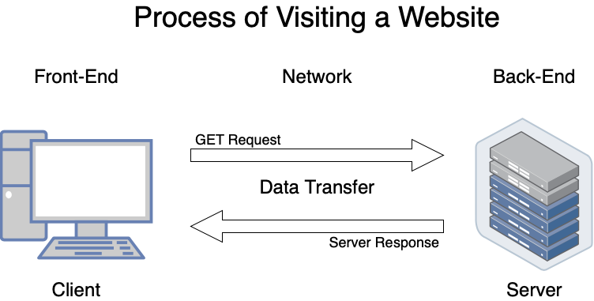

&nbsp;&nbsp;&nbsp;&nbsp;&nbsp;&nbsp;"It's slow" - this is a phrase I've heard a lot as someone who used to do tech support. If you don't know what is slow, or what could be causing the slow down; how are you supposed to fix it? Today we will talk about some of the common bottlenecks of websites, and what can be done to optimize performance.

## Where Do Bottlenecks Occur?

&nbsp;&nbsp;&nbsp;&nbsp;&nbsp;&nbsp;It's important to know what is happening behind the scenes when a user visits a website. I'm sure most of you already know how web traffic works, but it is important to highlight so we know what we can do to optimize performance. A client PC performs a GET request to the server, and the server (hopefully) responds with an index.html file. The browser parses through the html document, and when it finds instructions to download more files; subsequent requests are made to the server until the page is completely loaded. This means we have 3 areas we can target for optimization:

- Front-End
- Network
- Back-End

&nbsp;&nbsp;&nbsp;&nbsp;&nbsp;&nbsp;For the front-end, we can optimize our code and the critical render path. We can minimize the file size that we send over the network by leveraging compression technology. On the back-end we can use all sorts of cool technologies like CDN's, caching, load balancing **and more...**

## What's Next?

&nbsp;&nbsp;&nbsp;&nbsp;&nbsp;&nbsp;I'll continue this series with a deeper look into how we can actually gain better performance with our applications. We will take a look at reducing the stress on network traffic in the next article. Thanks for reading and see you next time!
