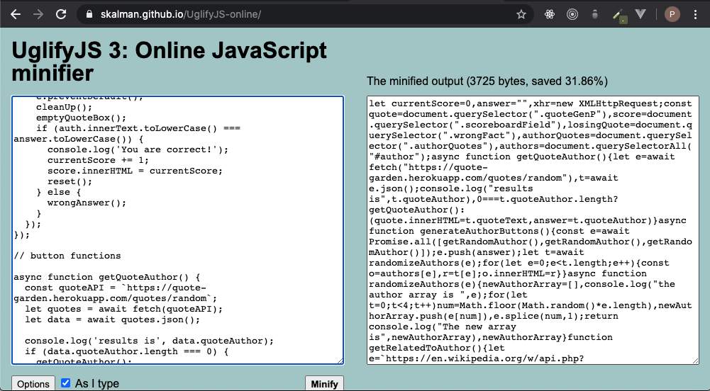
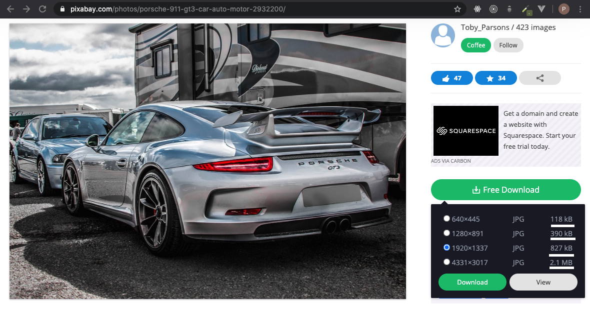

&nbsp;&nbsp;&nbsp;&nbsp;&nbsp;&nbsp;In the last article we talked about the three phases of visiting a web page, and what we can target for optimization. Today, we will focus on speeding up the data transfer between server and client. You can use these 3 strategies to greatly increase your site's load times, and improve customer experience.

## Minify Code

&nbsp;&nbsp;&nbsp;&nbsp;&nbsp;&nbsp;A surefire way to reduce load times is to lighten the payload from the server. We can do this by reducing the size of the files we send on every GET request. If you are unfamiliar with the concept of minifying, we are essentially taking out all the white space in our code. This doesn't sound like it would help all that much, but check out this example with Uglify.js:

&nbsp;&nbsp;&nbsp;&nbsp;&nbsp;&nbsp;The initial code was roughly ~200 lines, and by minifying it we were able to shave off nearly 32%. As your application increases in scale, this will have a larger impact. If you would like to start using Uglify.js in your project, the documentation can be found at: https://www.npmjs.com/package/uglify-js

## Image Resolution

&nbsp;&nbsp;&nbsp;&nbsp;&nbsp;&nbsp;The main culprit for slow websites comes from images. Image sizes can vary wildly, and it's important to take note what you are forcing your users to download when they visit your website. Things to consider are, how am I presenting this image? Is it part of a large hero section that needs a high resolution? Can I go a different route, like a simple illustration instead? Let's take a look at how image resolution greatly increases file size:

&nbsp;&nbsp;&nbsp;&nbsp;&nbsp;&nbsp;As you can see, if you wanted this picture to display on a small card; it would be completely overkill for you to force the client to download a 2.1 MB file on page load. You gain much better load performance by choosing a lower resolution image that fits your presentation. If you find yourself sold on an image, but can't find it in a resolution that fits your need, checkout a tool like https://tinypng.com/ to help get file size down.

## Media Queries

&nbsp;&nbsp;&nbsp;&nbsp;&nbsp;&nbsp;Another great strategy is to use media queries in your style sheets. Rather than just using them to change the site layout for mobile devices, you can have 2 versions of the same image; one high resolution and the other a lower resolution. You can point the smaller image to load on your mobile break points, and the larger for desktop sizes. On initial load, the browser will read the current window size and download the appropriate files you specified for that break point. This ensures that mobile devices will only ever download the smaller of the 2 images. This is important because cell networks are often metered and have slower speeds.

## What's Next?

&nbsp;&nbsp;&nbsp;&nbsp;&nbsp;&nbsp;In the next article we will talk about strategies we can use to optimize the code executed in the client's browser. Thanks for reading and see you next time!
