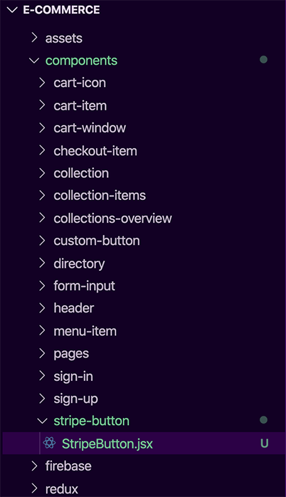
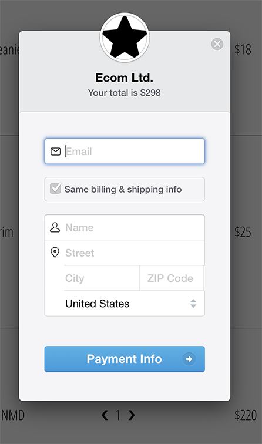

&nbsp;&nbsp;&nbsp;&nbsp;&nbsp;&nbsp;Stripe is a payment processor renowned for their awesome developer experience. Using Stripe to receive credit card information is a HUGE time saver during development; it is also a great strategy regarding security and protecting your users. This guide will get you started on using Stripe to take payments on your React applications. I will be covering the back-end setup at a later date, but for now; this is how you set up Stripe on the client side.

## Stripe Console

&nbsp;&nbsp;&nbsp;&nbsp;&nbsp;&nbsp;First things first, sign up for an account at https://stripe.com and verify your email address. This will give you access to the dashboard. Let's navigate to the developers area, and choose API keys in order to view our API keys. Save the publishable key to your clip board, we will be using it shortly.

## React Configuration

&nbsp;&nbsp;&nbsp;&nbsp;&nbsp;&nbsp;Now this is the cool stuff! Open up the terminal and install the react-stripe-checkout library with:

`npm i react-stripe-checkout`

&nbsp;&nbsp;&nbsp;&nbsp;&nbsp;&nbsp;After installing the library, let's navigate to our components folder and create a new component for the Stripe button that will trigger a payment modal:

&nbsp;&nbsp;&nbsp;&nbsp;&nbsp;&nbsp;Now we need to handle our imports in the new StripeButton component. Import React and StripeCheckout with:

`import React from 'react';`

`import StripeCheckout from 'react-stripe-checkout';`

&nbsp;&nbsp;&nbsp;&nbsp;&nbsp;&nbsp;Our StripeCheckoutButton component will be functional, and take in the price as an argument. One thing to note about Stripe, is that they look for the total amount to charge in cents. This means we will have to instantiate a new variable inside the function called priceForStripe; and set it to price \* 100 if you are working with USD. We will also need to assign our publishable key that we copied earlier to a variable inside this function as well. This functional component needs to return the

`<StripeCheckout />`

component we imported earlier. Your component should now look like this:

&nbsp;&nbsp;&nbsp;&nbsp;&nbsp;&nbsp;The StripeCheckout component takes in predefined props from the react-stripe-checkout library. These props configure the options your Stripe modal adheres to. Here is a list of most of the props you can pass and what they achieve:

&nbsp;&nbsp;&nbsp;&nbsp;&nbsp;&nbsp;I've configured my StripeCheckout component with the following properties:

`label='Pay Now'`

`name='Ecom Ltd.'`

`billingAddress`

`shippingAddress`

`image='https://svgshare.com/i/LWt.svg'`

`` description={`Your total is $${price}`} ``

`amount={priceForStripe}`

`panelLabel='Pay Now'`

`token={onToken}`

`stripeKey={publishableKey}`

&nbsp;&nbsp;&nbsp;&nbsp;&nbsp;&nbsp;For the token property, we need to make the onToken function. This onToken function will take in the token as an argument, and we will console.log the token for now and alert that a payment was successful. The token is generated on a successful payment, you will need to pass this token to the back-end to complete payment processing. For now, we are only focused on getting Stripe up and running on the client side. I will have another article for the back-end at a later date. Your finished StripeButton component should now look this:

&nbsp;&nbsp;&nbsp;&nbsp;&nbsp;&nbsp;Next step is to import this new StripeButton component into your checkout component and pass in the variable that houses the total cost of whatever you are charging:

&nbsp;&nbsp;&nbsp;&nbsp;&nbsp;&nbsp;Congratulations! You now have Stripe integrated with your React front-end. Launch your project and click the Pay Now button. You will see the following Modal that accepts a credit card:

&nbsp;&nbsp;&nbsp;&nbsp;&nbsp;&nbsp;To test functionality, fill in form, and use the following test credit card information:

Card number: `4242 4242 4242 4242`

MM / YY: `12 / 20`

CVC: `123`

&nbsp;&nbsp;&nbsp;&nbsp;&nbsp;&nbsp;You should see an alert for successful payment. If you open up the browser's developer tools, you should see the token that was generated because of the console.log statement we wrote in earlier.

&nbsp;&nbsp;&nbsp;&nbsp;&nbsp;&nbsp;This token will need to get passed through to your back-end, and then sent to Stripe to fully complete the transaction; but that is beyond the scope of this article. I only wanted to show how we can integrate Stripe with our React front-end for now. We will cover the back-end logic in a future article.

## What's Next?

&nbsp;&nbsp;&nbsp;&nbsp;&nbsp;&nbsp;Next we will talk about optimizing your applications and the importance site speed can have for your organization. This topic isn't really covered too often when you are starting out in web development, but it is super important to know how to squeeze every bit of performance out of your web applications.

Thanks for reading!
